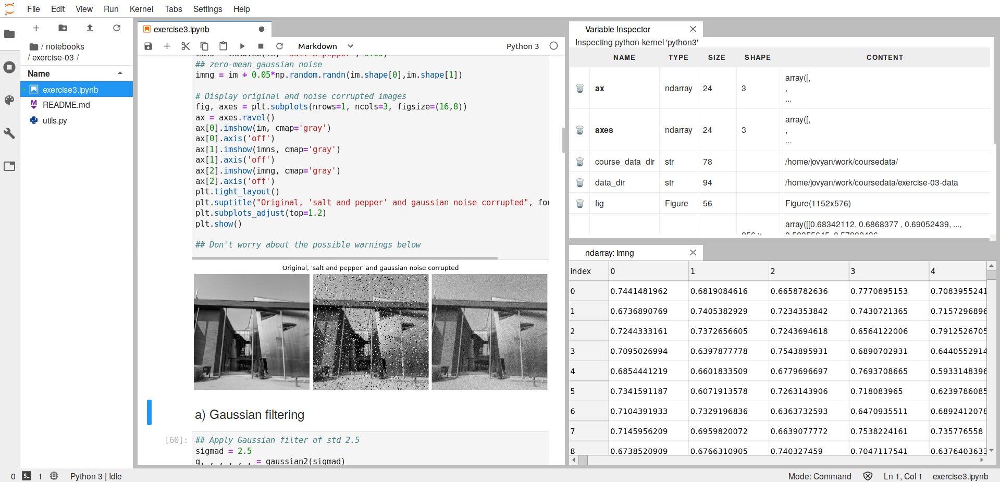

# CV_course_py_2019
CS-E4850 Computer Vision Course 2019 - Python assignments

This repository contains the Jupyter notebooks and related files used in the Python programming exercise for the CS-E4850 - Computer Vision course 2019 at the Aalto University, including (1) the actual weekly homework assignments and (2) all test images. Please, see the notebooks for more details on e.g. submission guideline.

## Instructions on how to work on the assignments

### 1. Recommended: Aalto JupyterHub

We have added the course to Aalto JupyterHub which you can access from the here: [Aalto JupyterHub](https://jupyter.cs.aalto.fi). JupyterHub Detailed instructions:
1. Select the Computer Vision course and click Spawn.
2. Select the Assignments tab and click Fetch on the assignments that are visible. Once new assignments are released you have to fetch them here.
3. The assignments are now visible under your Files tab (you might have to wait a moment for them to appear and/or click refresh). You can start working on the assignments by opening a Jupyter Notebook by clicking the .ipynb file inside the exercise folder.
4. JupyterLab is also available and we have added a useful [variable inspector extension](https://github.com/lckr/jupyterlab-variableInspector) to help you out. You can switch to JupyterLab by adding "lab/"" option to your URL:
  * change ...jupyter.cs.aalto.fi/user/your_username/tree/notebooks?
  * to ...jupyter.cs.aalto.fi/user/your_username/lab/tree/notebooks?.
  * Activate the variable inspector extension by opening a Notebook, right click with you mouse and choose "Open Variable Inspector". You can then drag the inspector to one side of the screen. NB: The extension is still experimental and might not work perfectly. If you experience serious problems, for example performance issues, kindly report them through MyCourses Forums or at the exercise sessions.
5. More information on for example how to access your JupyterHub data and JupyterHub in general can be found [here](https://scicomp.aalto.fi/aalto/jupyterhub.html).
6. Export your assignment to pdf and notebook format (.ipynb) and submit them both, the pdf and the notebook, through MyCourses.

Your JupyterLab environment could look something like this:

### 2. Through personal docker container

This option will yield exactly the same environment as option 1 above, but you'll now also be able to work on the assignments offline. If you have a basic understanding of Git and Docker this is an option.

1. Download [Docker](https://www.docker.com/).
2. Clone this repo using the following command:
  * `git clone --recurse-submodules https://github.com/AaltoVision/CV_course_py_2019.git`
3. Once new assignments are released you can pull them using:
  * `git submodule update --remote`
4. NB: Remember to use the above commands and not for example git pull. This repo uses git [submodules](https://git-scm.com/book/en/v2/Git-Tools-Submodules) that collect the separate repositories, notebooks and data, into this single repository so you don't have to update and clone two repositories. They are separated because it's more convenient for JupyterHub use.
5. Download the Docker image.
  * `docker pull apparvi/cv2019`
6. In the folder where you cloned the repositary create a container by running this bit of a monster command which is explained [here](https://hub.docker.com/r/apparvi/cv2019):
  * `docker run -it --name opencv --user $(id -u):$(id -g) --group-add users -v "$(pwd)":/home/jovyan/work -p 8888:8888 cv2019 start.sh jupyter lab --NotebookApp.custom_display_url='http://127.0.0.1:8888' --notebook-dir=/home/jovyan/work`
7. To start JupyterHub copy & paste the created URL to you browser.
8. In the future you can start the container with a more simple command:
  * `docker start -i cv2019`
9. Export your assignment to pdf and notebook format (.ipynb) and submit them both the pdf and the notebook through MyCourses.
